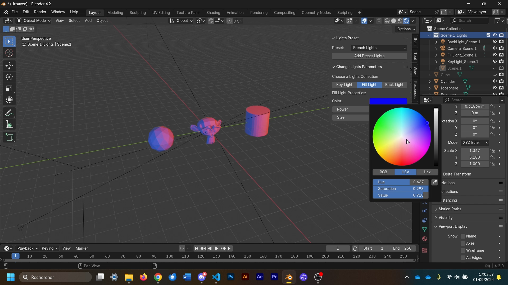

# EasyLifeRender

EasyLifeRender is a Blender addon that allows users to add lights and a camera around selected objects based on various presets.

## 🎨 Available Presets

✨ **Basic 3 Point Lights**  
Une configuration d'éclairage classique pour des scènes bien équilibrées.

🇫🇷 **French Lights**  
Des lumières inspirées par l'élégance à la française, pour une ambiance raffinée.

🌫️ **Tamised Lights**  
Un éclairage doux et tamisé pour une atmosphère chaleureuse et apaisante.

🔥 **Caliente Lights**  
Un éclairage chaud et vibrant, parfait pour des scènes pleines d'énergie.

🎶 **Samba Do Brazil Lights**  
Des lumières dynamiques et festives, inspirées par la chaleur du Brésil.

You can use it easily by downloading and installing it in your Blender.
## 🔗 Links

